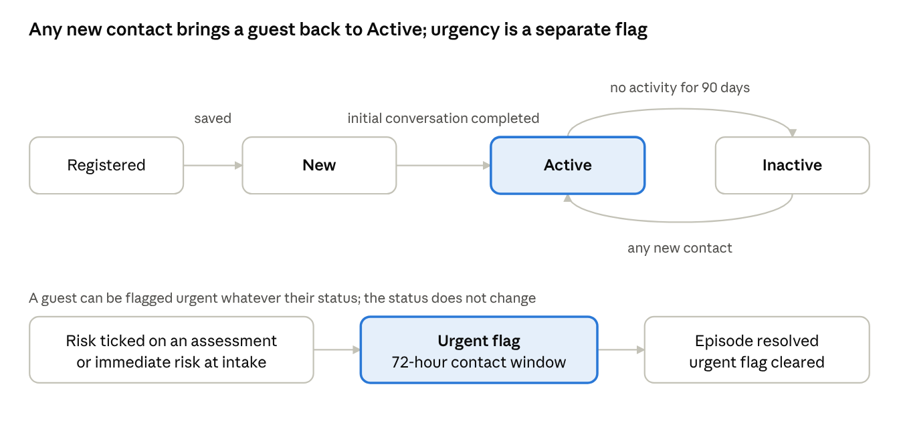

# EMHIP Tester Guide: Workflows and Options

_Version 1.0 · 30 September 2026 · For: the customer's testing team_

This guide lists every screen, workflow and option in EMHIP so the testing team can check all of it in one pass, and says what should happen at each step. It also lists what changed since the last round of testing, with a column to record each retest result. A live, commentable copy of this guide is kept at [claude.ai](https://claude.ai/code/artifact/dc8ab0bb-d1c8-4f5a-b4fb-aeba84042e4a).

## About this guide

- **Where to test:** [emhip.brainshub.co.uk](https://emhip.brainshub.co.uk). Use Chrome, Edge or Safari at 1280 px wide or more; the app also works on tablets.
- **Accounts:** test with at least one account per role (CMHW, CPN, Hub Manager, Admin). An Admin creates accounts under **Hub Workers**. Screens and buttons change with the role, so the same step can look different between accounts.
- **Test data only:** use made-up guests (for example "Test Guest 01"). Never enter real people's details.
- **Signing out:** the app signs you out after 30 minutes without activity. A banner gives a countdown and a **Stay signed in** button first.

**Reporting issues.** Add each issue as a new row in the feedback sheet (EMHIP\_EPR\_Testing\_Feedback.xlsx), using the same columns: Section, Issue, Priority (Must fix / Fix / Terminology) and Status (Open). For each issue, give the screen, the role you were signed in as, what you clicked, what you expected and what happened. A screenshot helps.

## Roles and permissions

There are four built-in roles. Each role adds to the one above it. An Admin can change any role under **Roles & Permissions**, so a changed role may not match this table.

| Role | Home dashboard | Can do everything a CMHW can, plus |
| --- | --- | --- |
| CMHW | CMHW dashboard (own caseload) | Register guests; edit demographics, clinical details, pathway and care plan; add contacts and notes; schedule and complete contacts; view urgent cases and reports; upload and edit documents |
| CPN | CMHW dashboard | Log CPN contacts: the "Is this a CPN contact?" switch in Add Contact, the Part 1 initial assessment and contact sessions |
| Hub Manager | Hub Manager dashboard (whole hub) | MDT Queue; export reports; delete and restore documents; Settings (view); a guest's Access Log; Export Record (the full guest record) |
| Admin | Hub Manager dashboard | Everything: Hub Workers, Roles & Permissions, all Settings, permanently delete documents, Anonymise record |

Some buttons appear for every role but only work with the right permission, for example **Raise Urgent Flag** and **Actions & Reminders**. With the built-in roles every user has the permissions those buttons need.

**Left menu by role**

- **Everyone:** Dashboard, Guest, Urgent Cases, Contact History, Reports, Log out.
- **Hub Manager adds:** MDT Queue (with a count of items waiting) and Settings (view only), also reachable from the cog in the top bar.
- **Admin adds:** Hub Workers and Roles & Permissions, and can change Settings.

## What changed since the last round

All 13 items in the feedback sheet are fixed and ready to retest. Numbers match the sheet. Record the retest result in the last column.

| # | Feedback | What changed | Where to retest | Retest result |
| --- | --- | --- | --- | --- |
| 1 | Cannot open guest profiles from the guest list | Guest names are links. The name, anywhere on the row, and **Open** all open the record; Ctrl-click or Cmd-click opens a new tab. A page left open while the system was updated now reloads into the record instead of doing nothing | Guest: click a name, a row, and Open | |
| 2 | Clicking an urgent case does nothing | An active case opens Urgent Case Details, which now also offers **Open full episode record**. Resolved cases could not be clicked before; they now open their episode record | Urgent Cases: click an active case and a resolved case | |
| 3 | Dashboard tiles and lists are not clickable | Every count opens the guests behind it: status tiles, Urgent Cases, pathway rows, clinical complexity, demographics bars, CPN tiles and guests, caseload rows, data quality rows and staff activity. The guest list names the view you came from. The CMHW dashboard tiles work too | Dashboard, as Hub Manager and as CMHW: the table under Workflows lists every link | |
| 5 | Documents should not be a menu item | Documents is no longer in the menu. Documents are managed from the guest's **Documents** tab, where uploads are linked to that guest automatically | Guest record, Documents tab, **Upload document** | |
| 6 | CPN sessions sit in the AFA & Hospitality tile | That tile now counts AFA and hospitality only. A separate **CPN activity** section shows CPN contacts, sessions, initial assessments and guests seen, with a CPN-only filter | Contact History | |
| 8 | Cross-filter demographics with DIALOG scores | DIALOG Outcomes has a **Demographics** filter. Every figure recalculates for the chosen group, and the group carries into the Excel export | Reports, DIALOG Outcomes, Demographics | |
| 9 | Demographics and referral sources missing from the export | The Excel workbook adds **Demographics** and **Referral sources** sheets; the CSV adds six demographic and referral columns | Reports, Export to Excel and Export CSV | |
| 10 | Reports tab bar looks cut off | Arrows and faded edges appear on whichever side has more tabs | Reports, at 1280 px wide or narrower | |
| 11 | "On hold" should be "Inactive" | Changed everywhere: badges, filters, dashboard tiles, reports, exports and data quality | Any status badge, filter or report | |
| 12 | "Follow-up" should be "Contact" | Changed everywhere: dashboards, Urgent Cases, Add Contact, Contact activity, Total contacts recorded, the Scheduled contacts screen, settings and emails. DIALOG "follow-up assessments" are now called reassessments | Throughout | |
| 13 | Typo "CASE MANGEMENT" | Now reads CASE MANAGEMENT | Left menu | |
| 14 | Technical labels in the staff activity log | Plain English ("Opened guest record", "Viewed urgent case") with the guest's name and reference, which opens the record. Repeated lines are merged. A guest's Access Log uses the same wording | Hub Manager dashboard, Staff activity; guest record, Access Log | |
| 15 | CMHW names are cut off | Full names wrap onto a second line in the guest list, dashboards and preview panels; the CMHW filter shows the full name on hover | Guest list; dashboard caseload and CPN tables | |

**Also fixed in this round** (found while preparing the handover; please retest these too)

- **Add Contact counts as activity:** submitting a contact note for an Inactive guest makes them Active again. Retest: submit a contact for an Inactive guest.
- **Guest record header:** shows the Urgent badge with the date raised, and the last activity date; Overview shows "Days since last activity".
- **Overdue scheduled contacts stay counted** after the overnight check, on the dashboards, banners, Next Contact column and caseload report.
- **CMHW dashboard numbers are the worker's own** caseload and scheduled contacts, not the whole hub's.
- **Clicking outside the Add Contact form no longer closes it.** Use the × or Cancel.
- **Settings apply to everyone:** for example set **Sign out after inactivity** to 5 minutes and check a CMHW account is signed out after 5 minutes.
- **Guest search** also matches the G-number, phone number and CMHW name.
- **Password rules** (10 characters, upper- and lower-case letters and a number) are shown on **Add hub worker**, **Reset password** and the sign-in **Reset password** page, and a refused password shows which rule it breaks.
- **The CPN role** can no longer be deleted.
- **Reports → Data Quality** rows open the affected guests, the same as the dashboard.
- **Reports** hides the export buttons from roles that cannot export (CMHW, CPN). Before, they showed and then failed.
- **The Urgent Cases count in the menu** goes down as soon as a case is resolved.
- **Email links** in urgent-case and overdue-contact emails open the website.
- **Only three pathways:** Mental Wellbeing, Clinical Support and Community Recovery are the only pathways in every filter, column, report and export, with the same names on every screen. The practical-support categories (Housing Advice and so on) and the Support Referrals card are removed.
- **Filters set by a link show in the dropdown:** opening the guest list from a dashboard count now shows the chosen Status or Pathway in its dropdown.
- **Next steps on the Demographics tab:** for a guest registered with the full five steps, it shows the initial conversation and DIALOG baseline as done (with dates) instead of always offering "Continue to Initial conversation".
- **Registration detail fields:** in step 2, answering **No** (or **Unknown**) to allergies, family history, inpatient admission, previous diagnosis or a risk-history question clears and greys out its detail field; **Yes** or **Unsure** opens it again.

**Changed on 6 October 2026**

- **Reason for change is required** when changing a guest's pathway (Pathway History, **Add New Pathway**). Without one, the dialog shows "Enter the reason for changing the pathway." and nothing is saved.
- **Next contact date is required in Add Contact.** Submitting without one is refused unless **No next contact needed** is ticked. Ticking it clears and greys out the date, and the note shows "No next contact needed" on the Notes tab. Drafts can still be saved without either.
- **Add Contact shows the right fields for each contact type:** Activity, Hospitality and AFA now have their own short forms from the design (see Add Contact under Workflows). Before, all four types showed the full casework note. Admins can edit the two new lists in **Settings → Lookups**: **Hub activities** and **AFA advice types**.
- **No outcome tags on contacts:** the Contact History tab, the Overview's Recent activity history and the Urgent Cases timeline no longer show "Successful" against each contact, because every contact the system logs is a completed one.

## Workflows

Each part below lists what a screen offers, who can use it, and what you should see. "Guest" means a person using the hub's services. Statuses are **New** (initial conversation not done), **Active** and **Inactive** (no activity for 90 days). **Urgent** is a separate flag that sits beside the status.

Recording any contact returns an Inactive guest to Active. Resolving an urgent episode clears the flag and leaves the status as it was.

### Signing in

1. **Sign in** with email and password. Wrong details show "Invalid email or password." Five failed attempts lock the account for 15 minutes.
2. **Forgot password** always replies "If an account exists…", so it never reveals which emails are registered. The emailed link opens **Reset password**. The new password needs at least 10 characters, with an upper-case letter, a lower-case letter and a number, and must match the confirmation.
3. **Inactivity:** after 29 minutes idle, a banner counts down 60 seconds. **Stay signed in** keeps the session; otherwise you return to sign-in with an inactivity notice.

### CMHW dashboard (CMHW and CPN)

- **Count cards** show your own caseload and scheduled contacts, and open their lists:
    - **Active caseload** opens the guest list filtered to your active guests.
    - **Due today** and **Overdue contacts** filter the caseload table below and scroll to it.
    - **Actions pending today** scrolls to the actions list.
- **Urgent banner:** shown when any guest is urgent. **View all urgent cases** opens Urgent Cases.
- **Overdue banner:** names guests whose scheduled contact has passed. They stay listed until a contact is logged.
- **Filter contacts:** search, a Pathway filter and Sort. The chips are All, Overdue, Due today and Upcoming this week. Click a guest's name, the row or **Open** to go to their record.
- **Guest Seen:** Today, Week, Month or a custom date range. The arrow expands a day-by-day chart.
- **Clinical complexity** (SMI, On medication, Trust involvement, CPN involvement): each tile opens the list of guests with that indicator.
- **Actions pending today:** click a row to open the guest. **Mark done** completes the scheduled contact.

### Hub Manager dashboard (Hub Manager and Admin)

Every count opens the guests behind it. The guest list then shows a banner (for example "Showing guests: SMI recorded · 12 guests"). **Show all guests** clears it.

> **Note:** the dashboard's counts are recalculated every 5 minutes. Straight after a change, a tile can differ from the list it opens until the next refresh.

| Dashboard item | What clicking it opens |
| --- | --- |
| Active guests / New / Inactive tile | Guest list filtered to that status |
| Urgent Cases tile | The Urgent Cases screen |
| Arrow on a tile | A 5-row preview under the tiles, with its own filters |
| Pathway distribution row | Guests on that clinical pathway |
| Clinical complexity tile | Guests with that indicator |
| Demographics bar (ethnicity, age group, gender, country) | Guest list with that demographic filter applied |
| CPN involvement tile | Guests with CPN involved, a completed Part 1, a CPN session in the last 30 days, or a CPN referral in the last 30 days |
| CPN involvement guest row | That guest's record; **View all guests with CPN involvement** opens the full list |
| Caseload per CMHW row, or **View** | That worker's guests; the Active and Urgent numbers open those slices |
| Outstanding team actions row | That guest's record; **view all actions** opens Scheduled contacts |
| Staff activity line | The guest's record (the guest's name is shown on each line) |
| Data quality row | The guests with that problem |

Staff activity is in plain English, for example "Opened guest record · Test Guest 01 (G-1001)" or "Viewed urgent case". Repeated lines for the same person and guest are merged into one.

### Guest list

- **Open a guest:** click the name, anywhere on the row, or **Open**. Ctrl-click or Cmd-click the name to open it in a new tab.
- **Search:** by name, G-number, phone number or CMHW name.
- **Filters:**
    - Pathway (Mental Wellbeing, Clinical Support, Community Recovery)
    - Status (New, Active, Inactive)
    - **Urgent only**
    - Assigned CMHW
    - Last activity
    - **Filters** drawer: ethnicity, age group, gender, country of origin
    - The reset icon clears everything.
- **Export Guest** downloads a CSV of the current filtered list, up to 2,000 rows.
- Long CMHW names are shown in full, wrapping onto a second line.

### Register a new guest

**Register New Guest** opens five steps. Use **Go Back** to move between steps. **Save Draft** does not store the registration, so finish it in one sitting.

1. **Demographics.**
    - Required: first and last name, date of birth (in the past), phone, ethnicity and consent.
    - Referral source and referral type. A secondary referral needs a subcategory.
    - **Register & schedule for later** saves the guest as New and stops here.
2. **Initial conversation.**
    - Session date and type, main concern, duration and impact, and an MDT summary.
    - Risk screening answers.
    - **Crisis notes** become required if escalation is answered "Yes".
    - Actions arising: each action needs a description and a due date.
3. **DIALOG.** Score all 11 life areas from 1 to 7. The total out of 77 and the high-concern count calculate automatically.
4. **Pathway and allocation.** Choose Mental Wellbeing, Clinical Support or Community Recovery. The first two also need an assigned CMHW and a next contact date.
5. **Review and Submit.**

Expected results after **Submit**:

- A progress list shows each part being saved.
- The guest becomes **Active**.
- The next contact is scheduled and actions are created.
- The DIALOG scores become the baseline.
- An MDT "Initial review" item is created when immediate risk is "Yes" or the pathway is Clinical Support.
- Immediate risk "Yes" also flags the guest urgent and opens an urgent episode.
- If one part fails, **Retry Submit** re-sends only the parts that did not save.

### Guest record

The header shows the guest's status, an Urgent badge when flagged, their pathway, reference (G-number), registration date, last activity and assigned CMHW. Header buttons:

- **Add Contact** opens the contact form (see the next part).
- **Raise Urgent Flag** opens Clinical Details with the risk form ready. The guest is only flagged once an assessment with at least one risk ticked is saved.
- **Export Record** (Hub Manager, Admin) downloads the complete record as a file. The export is written to the Access Log.
- **Anonymise record** (Admin) needs a reason of at least 10 characters and typing ANONYMISE. The guest then disappears from lists. Resolve any open urgent case first.

| Tab | What to test |
| --- | --- |
| Overview | Days since last activity, scheduled contacts, DIALOG baseline, recent activity, additional details |
| Demographics | Edit and save each section separately (contact and housing, identity and language, migration, GP, emergency contact); the completion checklist updates |
| Initial Conversation | For a New guest, **Start Initial Conversation**; completing it makes the guest Active, the same as registration step 2 |
| Clinical Details | **Edit details** (medication, diagnoses, SMI, CPN involved, Trust involvement); **Record assessment**: ticking any risk flags the guest urgent and opens an urgent case |
| DIALOG Scores | **Record new** scores; baseline and latest are compared |
| Pathway History | **Change Pathway** (date not in the future; "assigned by" and reason required); **Reassign CMHW** |
| Care Plan | Start or edit a plan with goals (each needs a description); **Close plan** as Completed or Superseded |
| Contact History | Every contact logged for this guest: type, date and who recorded it |
| CPN Record | Referral, MDT decision, CPN allocated, Part 1 status and CPN sessions; **Add CPN contact** |
| Documents | Where documents are managed now (Documents is no longer in the menu). **Upload document** links the file to this guest automatically, with no guest to choose. View details and versions, download, edit details, delete with a reason, and restore or permanently delete from the **Recycle bin** (Hub Manager, Admin) |
| Actions & Reminders | Add, complete, edit and delete actions |
| Notes | Casework notes (resume or discard drafts), attachments, quick notes with colour and **Pin to Overview** |
| Access Log (Hub Manager, Admin) | Who opened, changed, downloaded or exported the record, in plain English (for example "Opened guest record", "Changed: contact phone") |

### Add Contact

**Add Contact** is on the guest record and on each urgent case. For CPN staff it starts with **Is this a CPN contact?**

- **Ordinary contact:** the contact type changes the form.
    - **Activity:** date, **Activity** (from the Hub activities list) or **Describe the occasion** (one is required), Observation notes and **Risk check**. Button **Save activity contact**.
    - **Hospitality:** date and Logged by are auto-logged; optional Additional notes only. Button **Confirm & log hospitality**.
    - **AFA:** date, **Contact method**, **Description** (from the AFA advice types list) and **Risk check**. Button **Save AFA contact**.
    - The short forms have no SBAR note, actions, attachments, next contact date or referral switches.
    - **Casework:** method and date; the SBAR note (Situation, Background, **Assessment** (required), Recommendation); risk update, actions arising and attachments; and the **Next contact date** (required unless **No next contact needed** is ticked), which becomes a scheduled contact.
- **CPN contact:** choose **Initial assessment (Part 1)** or **Contact session**.
    - Part 1 is a ten-section assessment and can only be completed once per guest.
    - Contact sessions use the SBAR note, where Recommendation is also required.
- **Referral switches** at the end:
    - **Add this guest for MDT discussion** needs a reason.
    - **Refer this guest to the CPN** needs a reason and an urgency.
    - Both put an item on the Hub Manager's MDT Queue.
- **Save as draft** keeps the form open and needs only method and date. Adding an attachment saves a draft first.
- **Submit contact note** records the contact. It also creates the actions, the next scheduled contact and any MDT items, then opens the Notes tab.

### Urgent Cases

A guest becomes urgent when a risk assessment ticks any risk, or when immediate risk is "Yes" at intake. Their status does not change. Urgent cases must be contacted within 72 hours.

- **Summary cards:** Active urgent cases, Contact overdue, Within the 72-hour window, Resolved this month.
- **Filters:** Risk level, Assigned CMHW, Overdue only. **Export** downloads the visible cases as CSV.
- **Live updates:** new or resolved cases appear for everyone without refreshing. The chip by the title shows the connection state.
- **Click an active case** to open **Urgent Case Details**:
    - 72-hour countdown and CMHT status.
    - Crisis notes: **Add Crisis Note**.
    - Episode timeline.
    - Buttons: **Add contact**, **Open full episode record**, **Mark episode as resolved**, **Escalate to CMHT**, **Open full guest record**.
- **Row buttons:** **Open Guest**, **Add contact** and **Open Crisis Episode**.
- **Click a resolved case** (or **View Episode**) to open its full episode record. **Export Record** downloads it as a text file.
- **Escalate to CMHT** needs the team, a reason, an urgency and notes. CMHT notified then shows YES.
- **Mark episode as resolved:**
    - Optional: a note, a new pathway, a next contact date (not in the past), a change to session frequency, and inpatient admission.
    - The urgent flag clears and the case closes.
    - A new pathway and the next contact are recorded on the guest.

### MDT Queue (Hub Manager, Admin)

Items come from Add Contact (CPN referral, discussion request) and from intake (initial review). Filter chips narrow by type.

- **Confirm assign CPN** (CPN referrals) needs a CPN. The guest is then marked CPN involved.
- **Decline** needs a reason.
- **Mark as discussed** (initial reviews, discussions) needs an MDT note.
- Handled items move to **Reviewed**, which shows the outcome, note, reviewer and time.

### Contact History

One row per guest, with contact counts by type and the last contact date.

- **Summary tiles:** Total contacts, Casework, Activity, AFA & Hospitality.
- **CPN activity** has its own section, apart from AFA & Hospitality. It shows CPN contacts, sessions, initial assessments and guests seen by CPN.
    - **Show CPN contacts only** filters the list to guests with CPN contacts.
- **Filters:** search, type, **My caseload** (on by default for CMHWs), CMHW, and period (7, 30 or 90 days).
- **Row actions:** **View Note** opens the guest's notes. **Open** opens their contact history.
- **Export** downloads a CSV, including CPN initial assessments.

### Scheduled contacts

Opened from **view all actions** on the Hub Manager dashboard.

- Lists every scheduled contact, with filters by status, assignee, date range and overdue.
- **Mark complete**, **Record contact** and **Open Guest** on each row.
- **Schedule contact** sets a due date and assignee. You can also log a completed contact from the same form.

### Reports

Every role can view reports; exporting needs the Hub Manager or Admin role.

- **Tab bar:** when tabs do not fit, a round arrow appears on the side with hidden tabs and that edge fades. Click the arrow to scroll; the selected tab always scrolls into view.
- **Date range:** From and To with **Apply**, on Overview and CPN Activity. The default is the last 6 months, and To cannot be in the future.

| Tab | What it shows |
| --- | --- |
| Overview | Totals by status (New, Active, Inactive, Urgent), DIALOG outcomes, guests on each of the three pathways, monthly registrations, contact activity, referral sources, ethnicity |
| Guest Report | A filterable guest table: status, pathway, last activity, CMHW and the demographics drawer |
| Pathway Analytics | Per clinical pathway: guests, active, inactive, urgent, AFA support, average DIALOG score |
| Caseload Reports | Per worker: assigned, active, urgent, contacts in 30 days, overdue contacts, load; **View** opens that worker's guests |
| DIALOG Outcomes | Baselines, reassessments, average score change, trend and per-domain scores, all of which can be filtered by demographics (below) |
| Data Quality | Each issue with its count and share; **View guests** opens the affected guests |
| CPN Activity | Guests seen by the CPN, referrals, MDT confirmations, the referral pipeline and the CPN caseload |
| Export History | Who exported which report and when |

**DIALOG by demographics.** On DIALOG Outcomes, open **Demographics** and choose any mix of ethnicity, age group, gender and country of origin, then **Apply**. A bar reads, for example, "Showing: Black African · 18–24 · 23 guests". Every figure on the tab recalculates for that group only. A note warns when fewer than 5 guests in the group have been reassessed. The group stays selected when you change tabs, and it carries into the Excel export.

**Exports.**

- **Export to Excel** downloads a workbook with these sheets: Summary, Pathways, Caseload, DIALOG outcomes, Data quality, **Demographics** and **Referral sources**.
    - Demographics covers ethnicity, age group, gender and country of origin.
    - Referral sources covers source, type and subcategory.
    - Each row gives counts and percentages for all current guests and for guests registered in the period.
- **Export CSV** gives one row per guest registered in the period, with their pathway, status, ethnicity, age group, gender, country of origin, referral source and referral type.

### Hub Workers and Roles & Permissions (Admin)

- **Add hub worker** needs:
    - A unique email, which cannot be changed later.
    - A display name and the hub (pre-filled).
    - A temporary password of **at least 10 characters**, with an upper-case letter, a lower-case letter and a number.
    - At least one role.
- The new worker gets an "Account created" email when email is set up.
- **Edit** changes the name, hub, roles and the Active tick. Clearing Active has the same effect as **Deactivate**, which stops the worker signing in.
- **Reset password** sets a new temporary password. If it breaks a rule, the reason is shown in the dialog.
- **Roles & Permissions:**
    - **Add role** needs a unique name and the permissions to grant, ticked by group.
    - **Edit permissions** changes a role's permissions.
    - Only roles you added can be deleted. Permissions removed from a built-in role come back when the system restarts.

### Settings

Hub Managers can view Settings; only Admins can change them. Changes on the first seven tabs are held until **Save changes** (or **Discard**). Leaving with unsaved changes asks first.

| Tab | Options |
| --- | --- |
| General | Organisation name, support email |
| Document storage | Where files are kept (local, Amazon S3, S3-compatible, Azure, Google Cloud); **Test connection** |
| Uploads | Maximum file size (25 MB), allowed file types, how long documents are kept (7 years) |
| Clinical | Urgent response window (72 hours), inactivity threshold (90 days before a guest becomes Inactive), default contact interval, DIALOG review weeks |
| Interface | Guest list page size |
| Email | Provider (none, SMTP, Amazon SES, Mailgun); urgent-case emails; daily overdue-contacts email; **Send test email** |
| Security & data protection | Sign-out after inactivity (30 minutes; 0 turns it off); record retention period (20 years), which feeds the retention check in Data Quality |
| Email templates | Edit the subject and body of each email, preview it, turn it on or off, or restore the default |
| Lookups | The option lists used across the app (ethnicity, referral sources, CMHT teams, CPN referral reasons, MDT decline reasons and more): add, rename, reorder, deactivate |
| Custom fields | Extra questions on the guest record, documents, contact log, scheduled contacts and actions: text, number, date, yes/no, or choice lists, optionally required |
| Data migration (Admin) | Download the template, **Validate (dry run)** a CSV to see errors row by row, then **Import now** |

## Test checklist

Work through this in order: each part creates the data the next part needs. Tick each step when it behaves as described in Workflows.

**Admin setup**

- [ ] Create one test account for each role (CMHW, CPN, Hub Manager) under Hub Workers; confirm a 9-character password is refused with the reason shown
- [ ] Reset one worker's password, then deactivate and reactivate them
- [ ] Add a custom role with two permissions, then delete it
- [ ] Settings: add a Lookups option (for example an ethnicity), add a custom field on the guest record, and send a test email

**CMHW: register and record work**

- [ ] Register a full guest through all five steps and Submit; the guest is Active and the DIALOG baseline shows
- [ ] Register a second guest with **Register & schedule for later**; they are New, then complete their Initial Conversation from the record
- [ ] Edit and save each Demographics section
- [ ] Record new DIALOG scores and compare with the baseline
- [ ] Change Pathway (first try without a reason; it is refused) and reassign the CMHW
- [ ] Start a care plan with two goals, then close it
- [ ] Add, complete and delete an action
- [ ] Add a quick note and pin it to Overview
- [ ] **Add Contact**: save a draft, attach a file, resume it from Notes, then submit with a next contact date and an action
- [ ] **Add Contact** without a next contact date: submitting is refused; tick **No next contact needed** and submit; the note shows "No next contact needed" and no contact is scheduled
- [ ] **Add Contact** as Activity (try without an activity first; it is refused), Hospitality and AFA; each shows only its own fields, and the Notes tab shows what was recorded
- [ ] Add a contact with **Refer this guest to the CPN** and another with **Add this guest for MDT discussion**
- [ ] Documents tab: upload, edit details, upload a new version, download, delete
- [ ] Guest list: search by name, by G-number and by phone; use every filter and the demographics drawer; export the CSV
- [ ] CMHW dashboard: click each count tile and each chip; mark a scheduled contact done

**CPN**

- [ ] Add Contact as a CPN contact: complete the Part 1 initial assessment, then a contact session; check the CPN Record tab
- [ ] Confirm Part 1 cannot be started a second time for the same guest

**Urgent case**

- [ ] On Clinical Details, record an assessment with one risk ticked; the guest shows Urgent and appears on Urgent Cases (check a second browser updates without refreshing)
- [ ] Click the case: add a crisis note, add a contact, escalate to CMHT, and open the full episode record and export it
- [ ] Resolve the episode with a new pathway and a next contact date; the flag clears and the guest's status is unchanged
- [ ] Click the resolved case; its episode record opens

**Hub Manager**

- [ ] MDT Queue: confirm a CPN referral (assign a CPN), decline one, and mark a discussion as discussed
- [ ] Hub Manager dashboard: click every item in the table under Workflows and check each list's count matches the tile (allow 5 minutes after any change)
- [ ] Staff activity shows plain English with guest names; clicking a name opens the record
- [ ] Guest record: Access Log shows the actions above in plain English; **Export Record** downloads the file
- [ ] Contact History: tiles, the CPN activity section, **Show CPN contacts only**, each filter, and Export
- [ ] Reports: open every tab and check the tab-bar arrows at a narrow window; apply a date range
- [ ] DIALOG Outcomes: filter to one ethnicity and one age group; every figure changes and the Showing bar is correct
- [ ] Export to Excel: Demographics and Referral sources sheets are present and the DIALOG sheet names the group; Export CSV has the new columns
- [ ] Data Quality: **View guests** on a row opens the matching list

**Admin only**

- [ ] Anonymise a test guest; they disappear from lists and searches
- [ ] Documents recycle bin: restore one file and permanently delete another
- [ ] Data migration: download the template, validate a small file, then import it

**Terminology and layout (all screens)**

- [ ] No screen, export or email says "On hold" or "Follow-up"
- [ ] The left menu reads CASE MANAGEMENT and has no Documents item
- [ ] Long CMHW names are shown in full everywhere
- [ ] Stay idle for 30 minutes: the warning appears, then you are signed out
